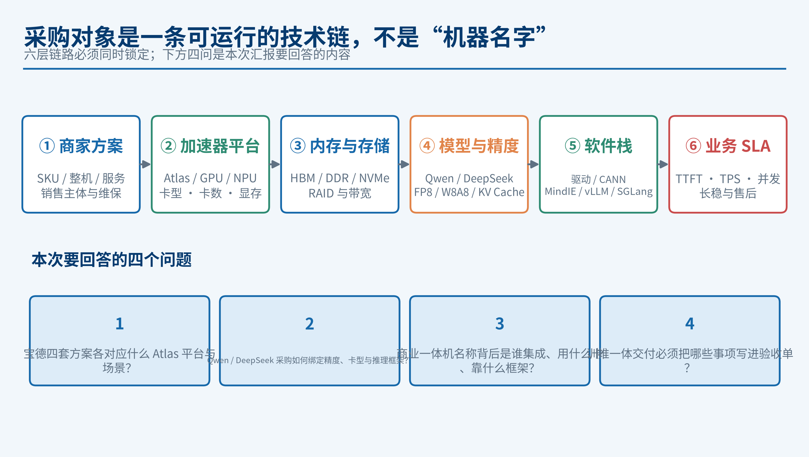
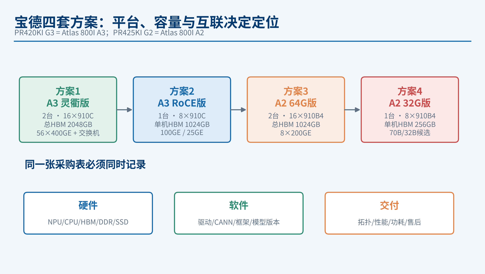
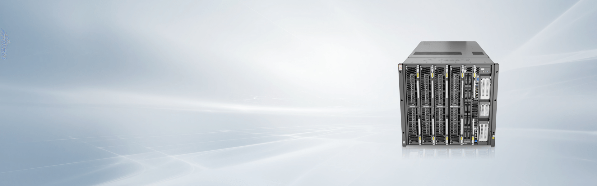
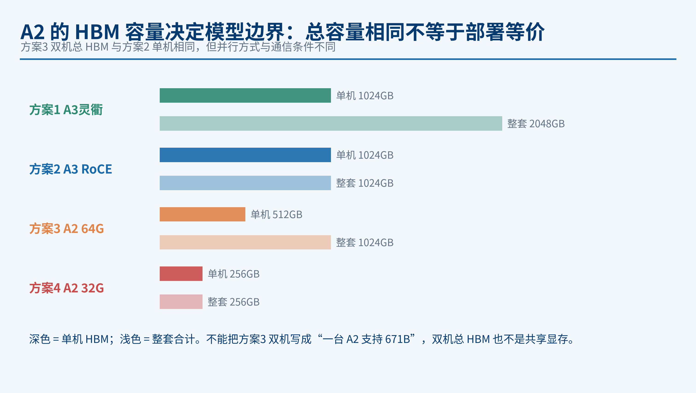
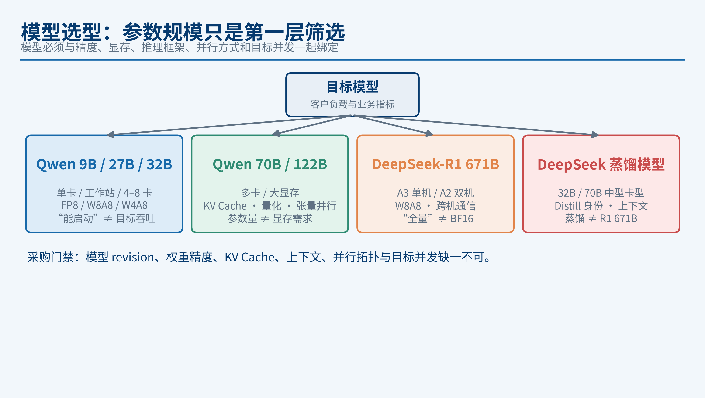
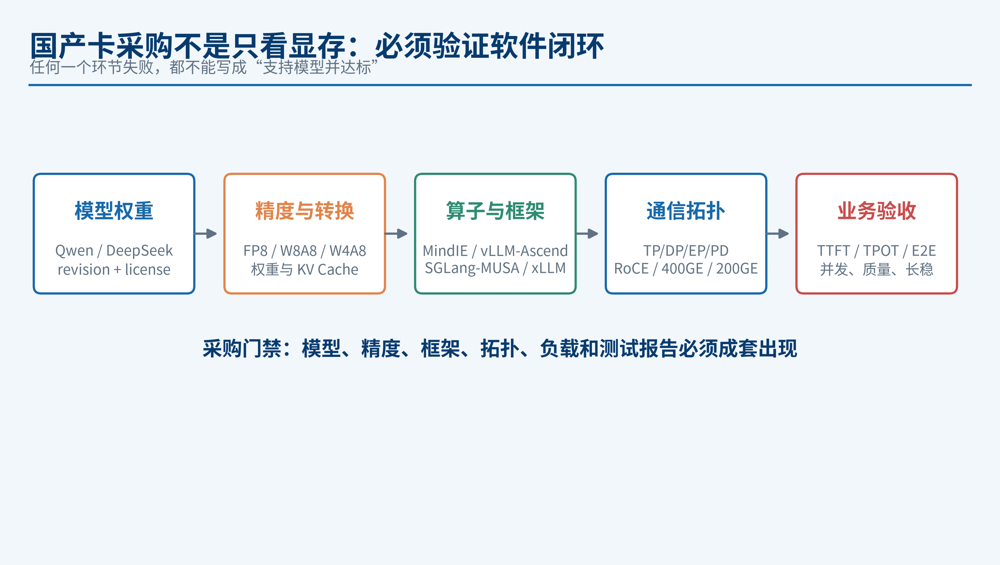
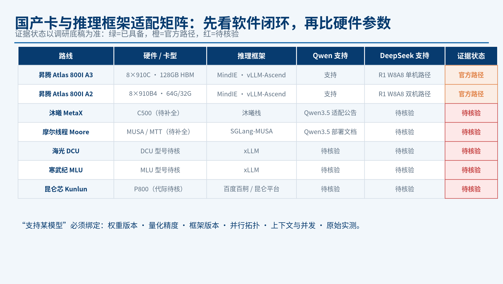
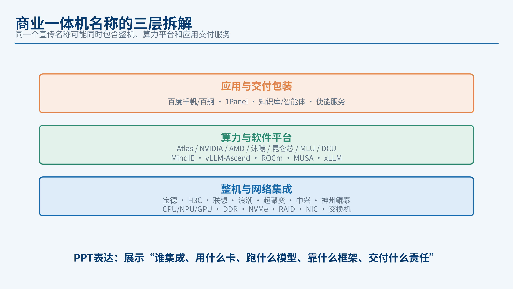
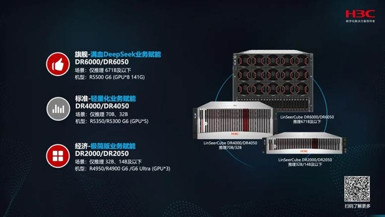

---
section_key: chain
section_title: 采购框架
subsection_title: 采购对象不是“机器名字”，而是一条可运行的技术链
order: 1
---

- **本次四问：** 宝德四套方案对应什么 Atlas 平台；Qwen/DeepSeek 如何绑定卡型、精度与框架；商业名称背后是谁集成、用什么卡；训推交付必须验收什么
- **核心判断：** 同一个“DeepSeek 一体机”名称可能只是模型方案包装，不能据此推断卡型、量化精度或并发能力

---
section_key: baode
section_title: 宝德四套方案
subsection_title: 四个 SKU 实际是 A3/A2、单机/双机与容量互联的组合
order: 2
---

| 方案 | 平台 | 规模 | 每台 NPU | 整套 HBM | 定位 |
|---|---|---|---|---|---|
| 方案 1 | Atlas 800I A3 灵衢版 | 2 台 | 8×910C 128GB | 2048GB | 多机扩展 / 超节点 |
| 方案 2 | Atlas 800I A3 RoCE 版 | 1 台 | 8×910C 128GB | 1024GB | 单机大模型推理 |
| 方案 3 | Atlas 800I A2 64G 版 | 2 台 | 8×910B4 64GB | 1024GB | A2 双机 R1 W8A8 路径 |
| 方案 4 | Atlas 800I A2 32G 版 | 1 台 | 8×910B4 32GB | 256GB | 70B/32B 蒸馏等中型模型 |

> **待供应商确认：** 报价右侧 2/1/2/1 暂按服务器台数理解；PR420KI G3 / PR425KI G2 与 Atlas 800I A3/A2 的正式型号对应、授权与交付主体需书面确认。

---
section_key: a3
section_title: A3 方案对比
subsection_title: 方案 1 与方案 2：同一 A3 单机核心，灵衢版买的是扩展能力
order: 3
---

- **相同项：** 单机 8×910C、每卡 128GB HBM（单机 1024GB）、4×鲲鹏 920、DDR5
- **方案 1 增量：** 双机规模、2TB DDR5、4×3.84TB NVMe，以及 **56×400GE 灵衢** 交换网络（方案 2 为 8×400GE RoCE 直出）
- **采购判断：** 单机推理优先比较方案 2；规划多机扩展 / 超节点再考虑方案 1
- **避免误读：** 灵衢版不是“单机算力更强”，它提高的是多机通信与扩展准备度

---
section_key: a2
section_title: A2 方案对比
subsection_title: 方案 3 与方案 4：A2 的 HBM 容量决定模型边界
order: 4
---

- **方案 3：** 8×64GB、512GB/台，双机合计 1024GB，方向与官方 A2 双机 R1 W8A8 路径一致
- **方案 4：** 8×32GB、256GB/台，定位 70B / 32B 蒸馏等中型模型
- **关键边界：** 总容量相同不等于部署等价；**双机总 HBM 不是共享显存**，不能写成“一台 A2 支持 671B”，也不能把方案 4 写成 671B 全量替代

---
section_key: model
section_title: 模型选型
subsection_title: 模型参数只是第一层筛选，必须绑定部署条件
order: 5
---

| 模型族 | 典型采购档位 | 必须核对 | 不能直接推导 |
|---|---|---|---|
| Qwen 9B/27B/32B | 单卡、工作站或 4/8 卡国产方案 | FP8/W8A8/W4A8、模型实现、框架支持 | “能启动”≠ 目标吞吐 |
| Qwen 70B/122B | 多卡或大显存服务器 | KV Cache、量化格式、张量并行、长上下文 | 参数量 ≠ 显存需求 |
| DeepSeek-R1 671B | A3 单机或 A2 双机等官方路径 | W8A8、跨卡/跨机通信、版本与服务配置 | “全量”≠ BF16 |
| DeepSeek 蒸馏模型 | 32B/70B 中型卡型 | Distill 身份、精度、上下文、质量回归 | 蒸馏模型 ≠ R1 671B |

> **门槛：** 模型 revision、权重精度、KV Cache、上下文、并行拓扑与目标并发缺一不可。

---
section_key: domestic
section_title: 国产卡采购
subsection_title: 先验收软件闭环，再比较硬件参数
order: 6
---

- **采购风险常来自软件：** 框架、算子、量化与通信适配，而不是单张卡的标称 HBM
- **主线路线：** 以华为昇腾 Atlas A3/A2 为主线，扩展沐曦、摩尔线程、海光 DCU、寒武纪 MLU、昆仑芯
- **每条路线固定记录：** 卡型、驱动/工具链、推理框架、模型支持矩阵、量化路径、实测版本
- **验收链：** 模型权重 → 转换/量化 → 算子支持 → 单卡启动 → 多卡通信 → 长上下文 → 并发/稳定性

---
section_key: matrix
section_title: 适配矩阵
subsection_title: 国产卡 × 推理框架 × 模型：证据状态分层
order: 7
---

- **昇腾（官方路径）：** Atlas 800I A3/A2 + MindIE / vLLM-Ascend，已登记 R1 W8A8 单机/双机路径与 Qwen 支持
- **待核验路线：** 沐曦（Qwen3.5 适配公告）、摩尔线程（SGLang-MUSA）、海光 DCU / 寒武纪 MLU（xLLM）、昆仑芯（百舸/昆仑平台）
- **证据规则：** 产品宣传名称不能自动升级为“已验证能力”；缺字段时只能写“官方路径 / 供应商声称 / 待核验”

---
section_key: commercial
section_title: 商业一体机拆名
subsection_title: 整机厂商 / 算力平台 / 应用交付，三层不能混为一谈
order: 8
---

- **整机集成：** 宝德、H3C、联想、浪潮、超聚变、中兴、神州鲲泰等
- **算力/平台路线：** 华为昇腾 Atlas、NVIDIA、AMD、沐曦、昆仑芯、摩尔线程、海光 DCU、寒武纪 MLU
- **应用/交付包装：** 百度千帆/百舸、中国电子云、1Panel、知识库/智能体平台与厂商使能服务
- **表达方式：** 每家只写“谁集成、用什么卡、跑什么模型、靠什么框架、交付什么责任”，没有完整 BOM 的放“待询价”

