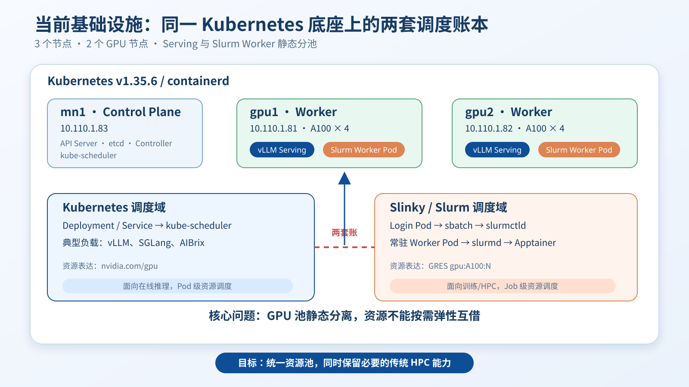
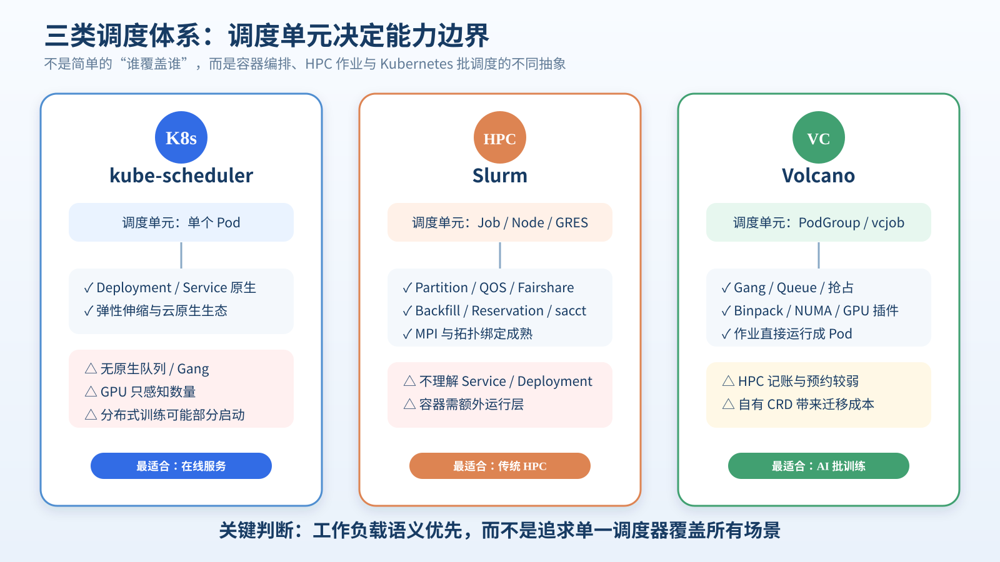
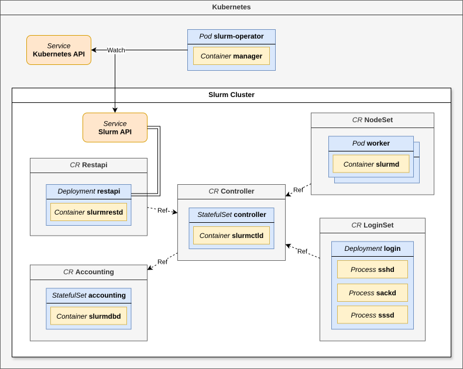
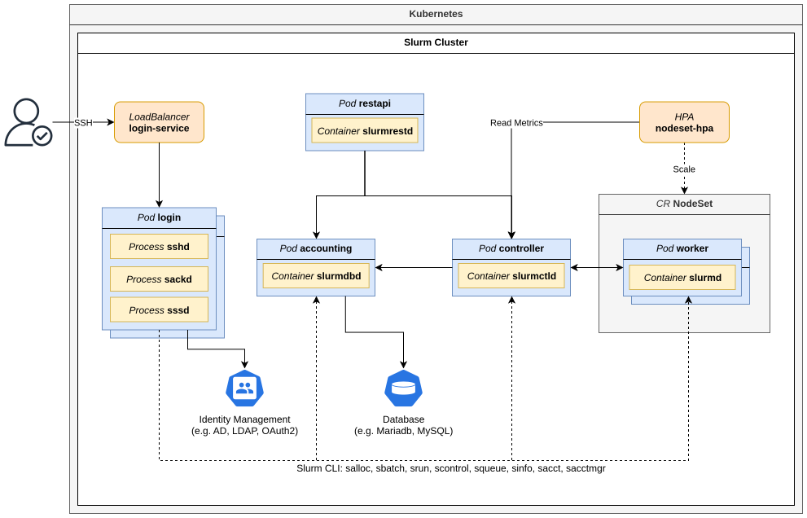
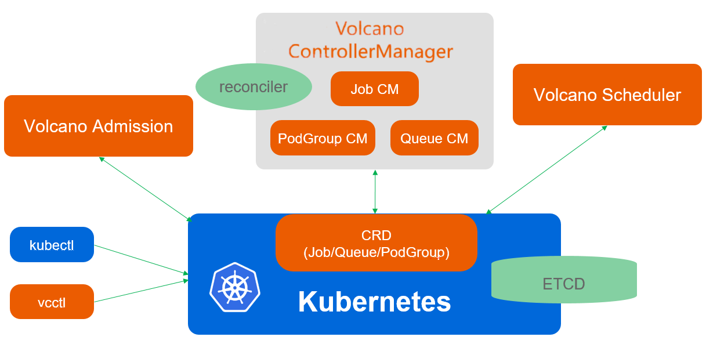
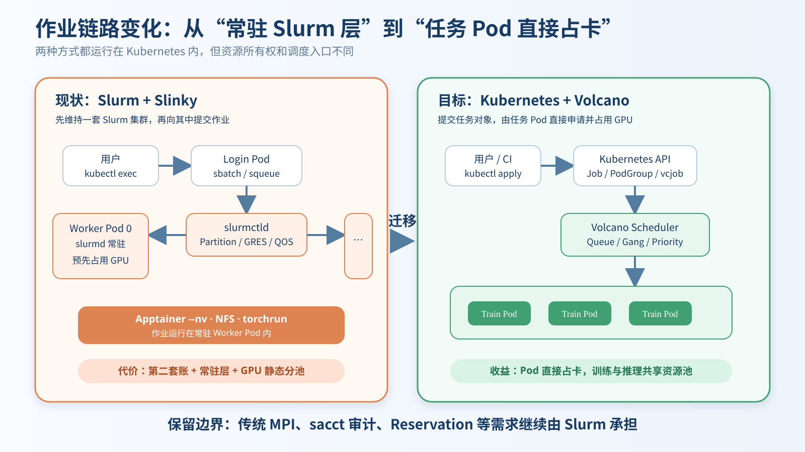
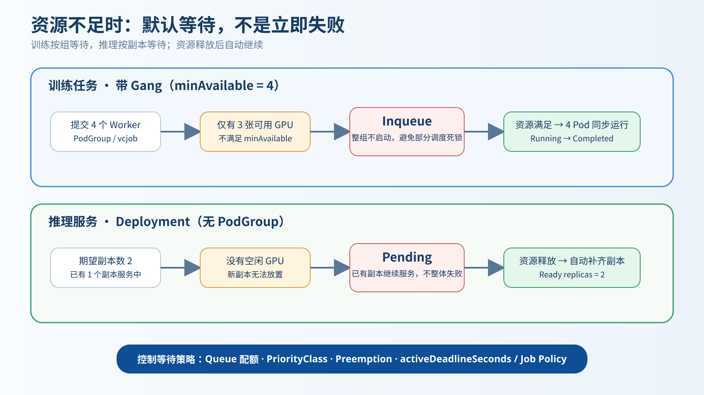
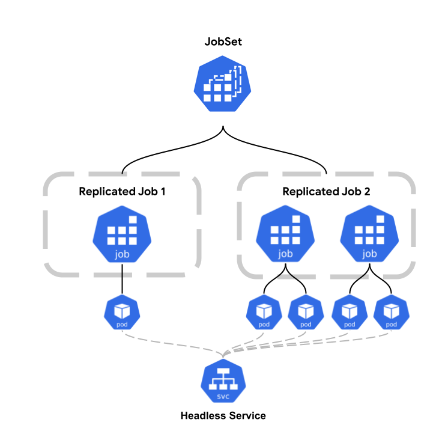
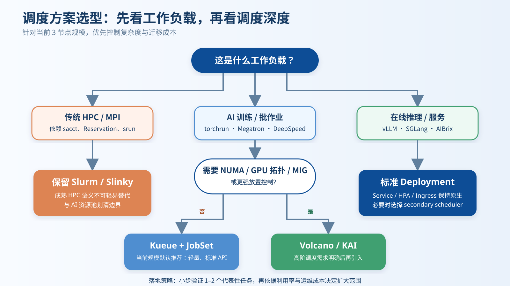

---
section_key: conclusion-first
section_title: 结论先行
subsection_title: 先看结论：按工作负载分工，而非“一刀切”替代
order: 1
---

| 工作负载 | 首选调度路径 | 关键理由 |
|---|---|---|
| **在线推理 / Serving** | Kubernetes Deployment | Service、滚动升级、弹性伸缩原生 |
| **AI 批训练（当前规模）** | **Kueue + JobSet** | 轻量、标准 API、Gang 语义够用 |
| **深度 GPU / NUMA / 拓扑调度** | Volcano 或 NVIDIA KAI | 放置策略与硬件感知更强 |
| **传统 HPC / MPI / sacct 记账** | 保留 Slurm / Slinky | 作业生态、审计与预约能力成熟 |

> 核心方向：让 AI 训练与推理逐步共享 Kubernetes GPU 池；Slurm 只保留其不可替代的传统 HPC 边界。

---
section_key: current
section_title: 现状与矛盾
subsection_title: 当前基础设施：同一底座上的两套调度账本
order: 2
---

**现状：** Kubernetes 承载推理，Slinky/Slurm 承载训练；每个 GPU worker 暴露 **A100 × 4**。  
**核心矛盾：** 训练池与推理池静态分离，GPU 无法弹性互借，并需维护常驻 worker。

---
section_key: principles
section_title: 原理对比
subsection_title: 三类调度体系的本质差异
order: 3
---

> 判断调度器不能只看功能清单，首先要看它的调度单元：**Pod、HPC Job，还是 PodGroup / vcjob**。

---
section_key: principles
section_title: 原理对比
subsection_title: Kubernetes：云原生底座，但默认只调度单个 Pod
order: 4
---

- `kube-scheduler` 逐 Pod 做资源匹配，适合 Deployment / Service
- GPU 默认只感知“数量”，不天然理解多机训练的整体启动条件
- 多 worker 训练若部分启动、部分等待，可能形成资源占用与等待死锁

**需要补齐：** Gang Scheduling、队列与配额、公平调度、优先级与抢占。

---
section_key: principles
section_title: 原理对比
subsection_title: Slurm + Slinky：成熟 HPC 能力，代价是中间常驻层
order: 5
---

- 提交流程：`kubectl exec → Login Pod → sbatch → slurmctld → Worker Pod`
- 优势：Partition、QOS、fairshare、backfill、依赖、记账与 MPI 生态
- 当前代价：worker Pod 常驻占卡，Slurm 与 Kubernetes **各自记账**

---
section_key: principles
section_title: 原理对比
subsection_title: Volcano：为 Kubernetes 补齐批作业调度能力
order: 6
---

| 能力 | Volcano 提供的语义 |
|---|---|
| 集合调度 | `PodGroup / minAvailable`，整组满足才启动 |
| 多租户 | `Queue`、weight、弹性配额与跨队列借用 |
| 作业控制 | `vcjob`、DAG、重试策略、优先级与抢占 |
| 深度放置 | binpack、NUMA、GPU 拓扑相关插件 |

---
section_key: migration
section_title: 迁移路径
subsection_title: 从“常驻 Slurm 层”转为“任务 Pod 直接占卡”
order: 7
---

**迁移对象：** Apptainer `.sif` → OCI 镜像；`#SBATCH --gres` → Pod `nvidia.com/gpu`；  
`squeue / sacct` → Kubernetes 状态、监控与成本系统。传统 HPC 能力仍保留在 Slurm 边界内。

---
section_key: behavior
section_title: 运行行为
subsection_title: GPU 不足时：默认等待，不是立即失败
order: 8
---

| 场景 | 资源不足时 | 资源释放后 |
|---|---|---|
| Gang 训练 | 整个 Job `Inqueue`，不部分启动 | 整组调度并运行 |
| 在线推理扩容 | 新副本 `Pending`，已有副本继续服务 | 自动补齐新副本 |

可进一步通过 Queue、PriorityClass、Preemption、`activeDeadlineSeconds` 与 Job Policy 控制等待边界。

---
section_key: boundary
section_title: 能力边界
subsection_title: Volcano 能覆盖 AI 训练，但不能照搬全部 Slurm 能力
order: 9
---

| 能力维度 | Volcano / Kubernetes | Slurm | 迁移判断 |
|---|---|---|---|
| Gang、队列、抢占 | 强 | 强 | AI 训练可迁移 |
| Service / HPA / Ingress | 原生 | 非目标 | 推理留在 Kubernetes |
| `sacct` 记账与审计 | 需外接系统 | 原生成熟 | 有强审计需求则保留 Slurm |
| Reservation / Job Array / Step | 较弱或需组合 | 原生成熟 | 脚本需改造 |
| MPI / `srun` 生态 | 需 MPI Operator | 原生成熟 | 传统 HPC 不宜强迁 |
| NUMA / 拓扑 / GRES | 有插件，成熟度依场景 | 长期深耕 | 先用真实作业验证 |

**边界原则：** AI/ML 批任务优先云原生化；传统 HPC、预约、记账类负载继续走 Slurm。

---
section_key: alternatives
section_title: 方案选型
subsection_title: Kueue + JobSet：当前三节点集群的默认推荐
order: 10
---

- **Kueue** 管“何时准入、占多少配额”；任务仍是标准 Kubernetes API
- **JobSet** 管“一组 Job 如何整体启动与完成”，适合 TP / DP 分布式训练
- 需要更深 GPU 放置时，可让 **Kueue 管队列，Volcano / KAI 管实际调度**

> 对 3 节点规模，先选择低复杂度；只有真实瓶颈出现后再增加调度深度。

---
section_key: alternatives
section_title: 方案选型
subsection_title: 推荐目标形态：一套 GPU 池，按负载选择入口
order: 11
---

**演进路线：** 短期保留 Slinky 并试点代表性 AI 作业；中期让推理与训练共享 GPU、由 Queue 逻辑隔离；长期仅在传统 HPC、MPI 与强记账负载边界内保留 Slurm。

---
section_key: rollout
section_title: 落地计划
subsection_title: 四阶段实施：从可回退试点到按负载收敛
order: 12
---

| 阶段 | 主要动作 | 退出条件 |
|---|---|---|
| **1. 基线** | 记录 GPU 利用率、排队时间、失败率与运维成本 | 有可对照的现状数据 |
| **2. 最小试点** | 部署 Kueue + JobSet；建立 Queue 与优先级 | 控制面稳定、可完整卸载 |
| **3. 代表任务** | 迁移 Qwen 评测训练；保持 vLLM Serving | Gang、NCCL、存储与镜像通过 |
| **4. 对比决策** | 压测资源竞争、抢占、故障恢复与回退 | 数据支持扩大或停止迁移 |

**安全原则：** 不直接改造全部作业；先建立 OCI 镜像、NFS/PVC、监控与回退通道。

---
section_key: rollout
section_title: 落地计划
subsection_title: 验收指标：用数据决定是否继续迁移
order: 13
---

| 维度 | 建议指标 | 关注点 |
|---|---|---|
| 资源效率 | GPU 利用率、碎片率、跨队列借用率 | 是否真正改善静态分池 |
| 调度体验 | P50/P95 排队时间、Gang 启动成功率 | 是否减少部分调度和长等待 |
| 训练性能 | tokens/s、NCCL 初始化、节点间通信 | 云原生化不能牺牲吞吐 |
| 服务稳定性 | 推理 SLO、扩容时间、抢占影响 | Serving 不能被批任务拖垮 |
| 运维成本 | 常驻 Pod 数、故障恢复时间、变更复杂度 | 是否减少第二套账成本 |

**决策门槛：** 先证明共享池收益，再决定是否引入 Volcano / KAI 的高级能力。

---
section_key: summary
section_title: 总结
subsection_title: 最终建议
order: 14
---

1. **近期选择 Kueue + JobSet**：最适合当前三节点规模，学习与回退成本最低
2. **Volcano 按需引入**：当 GPU 拓扑、NUMA、MIG/MPS 或复杂队列成为真实瓶颈
3. **推理保持 Kubernetes 原生**：Deployment / Service 不应强行套入批作业 API
4. **Slurm 保留明确边界**：继续服务传统 HPC、MPI、记账与预约类作业
5. **先试点再收敛**：用利用率、排队、吞吐、稳定性和运维成本做最终决策

> 目标不是更换一个调度器，而是建立一套可共享、可观测、可回退的 GPU 资源治理体系。

**谢谢，欢迎讨论。**
