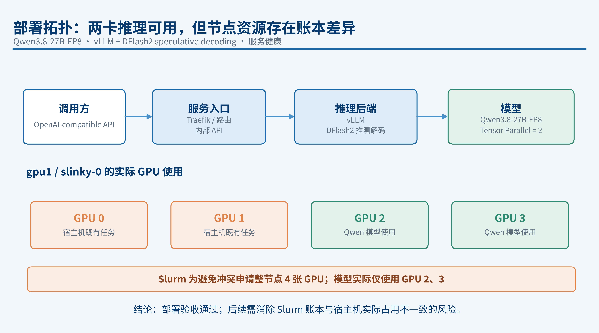
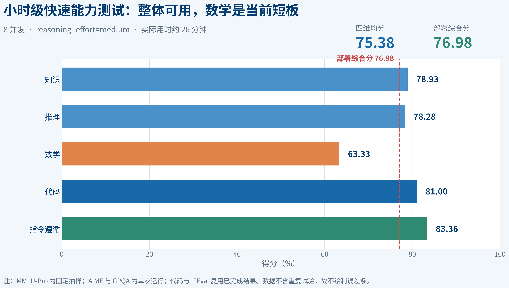
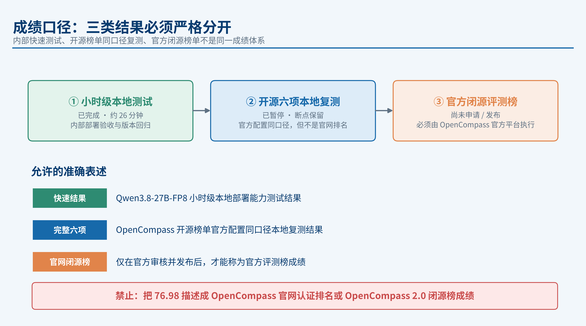

---
section_key: conclusion
section_title: 结论先行
subsection_title: 部署完成，本地快速测试成绩 76.98，可用但非官方排名
order: 1
---

**一句话结论：** 两卡部署已完成并稳定运行；30 分钟级快速套件得分 **75.38 / 76.98**，可用于部署验收与内部回归，但它是**本地快速测试成绩，不是 OpenCompass 官网排名**。

- **部署完成：** vLLM + DFlash2，两张 A100 张量并行，API 健康
- **快速测试完成：** 8 并发，约 26 分钟，覆盖五类能力
- **核心成绩：** 四维均分 **75.38**，五维部署综合分 **76.98**
- **当前判断：** 已满足部署验收和内部回归使用；不能表述为 OpenCompass 官网排名

---
section_key: deployment
section_title: 部署与评测设计
subsection_title: 固定配置 + 固定样本：约 26 分钟稳定覆盖五类能力
order: 2
---

- **模型与推理：** Qwen3.8-27B-FP8（Commit `017b9c7`）· vLLM + DFlash2 · Tensor Parallel = 2
- **评测与参数：** OpenCompass 0.5.4（Commit `20586a2`）· `reasoning_effort=medium` · 8 并发 · 最大输出 8192 tokens
- **测试规模：** MMLU-Pro 280 · GPQA 198 · AIME 30 · 复用代码与 IFEval 结果

> **部署注意：** Slurm 为避免任务冲突申请整节点 4 张 GPU，模型实际只使用 GPU 2、3；后续需消除调度账本与宿主机实际占用不一致的风险。

---
section_key: scores
section_title: 快速能力成绩
subsection_title: 指令遵循与代码较强，数学为唯一明显短板
order: 3
---

- **四维均分 75.38，五维部署综合分 76.98**，横向对比应优先看分维度
- 数学为最低项（63.33），后续对比部署或推理参数时优先关注

> **口径脚注：** MMLU-Pro 固定抽样；AIME、GPQA 单次运行；代码用 HumanEval+ 与 MBPP+（非 LiveCodeBench v6）。结果仅适用于相同快速配置下的部署验收与横向比较。

---
section_key: boundary
section_title: 成绩口径
subsection_title: 本地快速结果 ≠ OpenCompass 官方榜单成绩
order: 4
---

- 76.98 是**内部五维部署综合分**；完整六项即使跑完也只是**官方配置同口径本地复测**
- **完整评测进度：** IFEval 83.36 可复用；MMLU-Pro 至少 1563/12032（约 13.0%）；HLE、AIME×32、GPQA×4 与 LiveCodeBench v6 未完成；稳定并发后预计还需 2–4 天

---
section_key: next
section_title: 建议与下一步
subsection_title: 建立分级评测门禁，把完整评测留给最终候选
order: 5
---

1. **部署冒烟：** 5–15 分钟，先排除接口、模板、截断和输出格式问题
2. **小时级能力：** 固定本次五维套件，作为模型、量化和推理框架的标准回归
3. **完整开源六项：** 只对最终候选执行，使用完整数据、重复次数、Verifier 和代码沙箱
4. **官方闭源评测：** 只有确需官网成绩时再准备公开仓库与组织资料申请

> **内部门禁建议：** 单项下降超过 3 分需复核；综合分下降超过 2 分时，阻止直接替换生产部署。